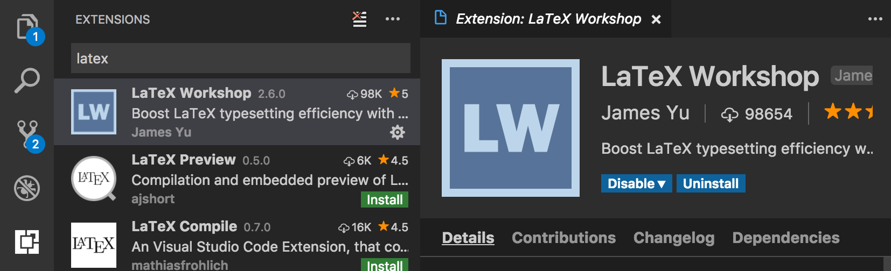

# 日本語版Latexの環境の用意の仕方
### GitPitchのテスト

Yuki Ueda

---

### VS Code,Latex
以下の２つをインストール
* VS Code(https://code.visualstudio.com/)
* Latex(https://texwiki.texjp.org/?TeX%E5%85%A5%E6%89%8B%E6%B3%95)

---

### Latex-Workshop
VS Codeからインストール

インストール後に再読み込み

---

### settings.jsonの設定
settings.json(Windows: `ファイル > 基本設定 > 設定`， Mac: `Code > 基本設定 > 設定`)の[ ]の間に以下を追加

```json
"latex-workshop.latex.toolchain": [
        {
            "command": "ptex2pdf",
            "args": [
                "-l",
                "-ot",
                "-kanji=utf8 -synctex=1",
                "%DOC%"
            ]
        },
        {
            "command": "pbibtex",
            "args": [
                "%DOCFILE%",
                "-kanji=utf8"
            ]
        },
        {
            "command": "ptex2pdf",
            "args": [
                "-l",
                "-ot",
                "-kanji=utf8 -synctex=1",
                "%DOC%"
            ]
        },
        {
            "command": "ptex2pdf",
            "args": [
                "-l",
                "-ot",
                "-kanji=utf8 -synctex=1",
                "%DOC%"
            ]
        }
],
"editor.renderControlCharacters": true
``` 
@[37](MacのSierraを利用して場合に見えない記号を表示するために必要，そうでなければ消しても大丈夫)

---

### Latexのコンパイル
* ファイルを保存(`⌘+S`)または`F1`キーを押して`Build Latex Project`を入力，実行するとコンパイルされる．
* `F1`キーの後， `View PDF File in new tab`でPDFを見れる．
* エラーが出た場合は `表示-> 統合ターミナル`で下に端末が出るのでその中の`出力`を確認